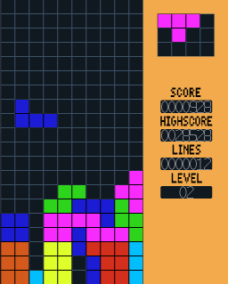

# Tetris
## Description of Project
A revamped remake of the retro puzzle game 'Tetris' using C++ and SDL2, a multimedia library. The objective of the game is to score the most points possible before the game pieces reach the top of the board. Players score points by filling a row with pieces. The more rows cleared at once, the more points. There is a level progression system that goes to level 10, and each level increases the speed of the tetris pieces falling. Can you beat my highscore of 28,528?  

## How to execute
### On MacOS
Make sure you have SDL2 and SDL2_Image libraries installed. If not install them via brew in the terminal by typing `brew install SDL2` and `brew install SDL2_image`  
Run the contents of `main.cpp` with `make` in the terminal followed by `./main`. If the `make` command does not register, run the full Makefile command `g++ src/main.cpp src/screen.cpp src/gameover.cpp src/gameplay.cpp src/texture.cpp src/gameMap.cpp src/tetromino.cpp src/score.cpp -o main -I include -L lib -l SDL2-2.0.0 -l SDL2_image-2.0.0`

### On Windows
Run the command `g++ src/main.cpp src/screen.cpp src/gameover.cpp src/gameplay.cpp src/texture.cpp src/gameMap.cpp src/tetromino.cpp src/score.cpp -o main -I includeWindows -L libWindows -l SDL2 -l SDL2_image` in the command prompt followed by `./main` or `./main.exe`

## Controls
Left: Move piece left  
Right: Move piece right  
Up: Rotate piece clockwise  
Down: Move piece down  
Space Bar: Quick drop piece  

Q: Quit  
R: Retry  
